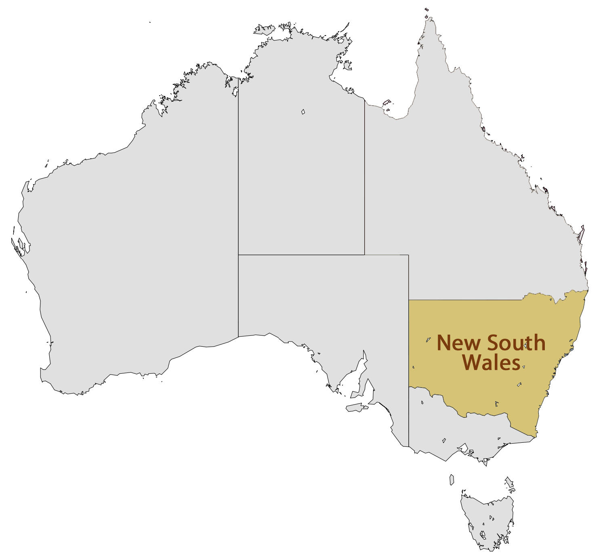
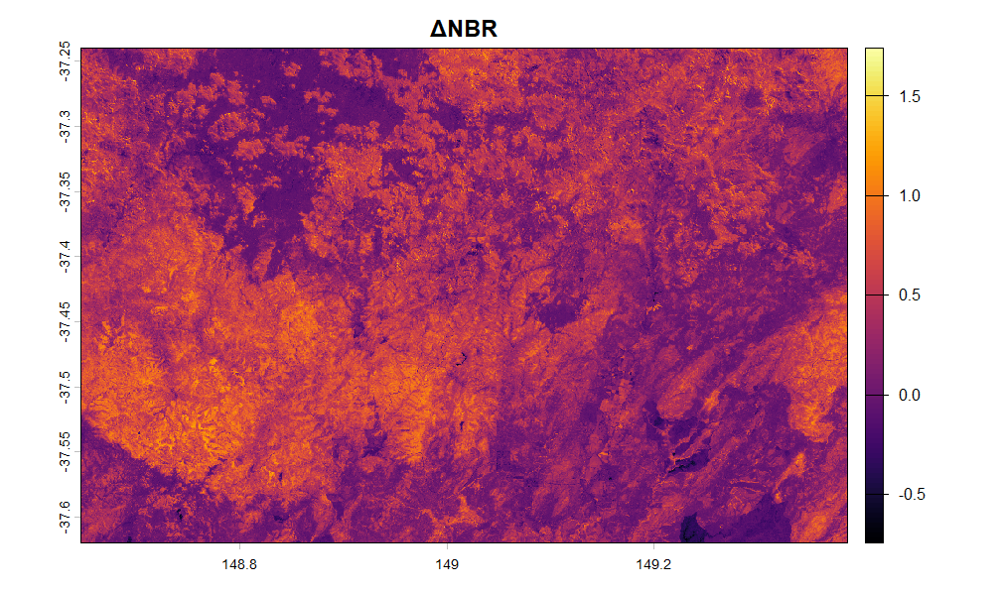
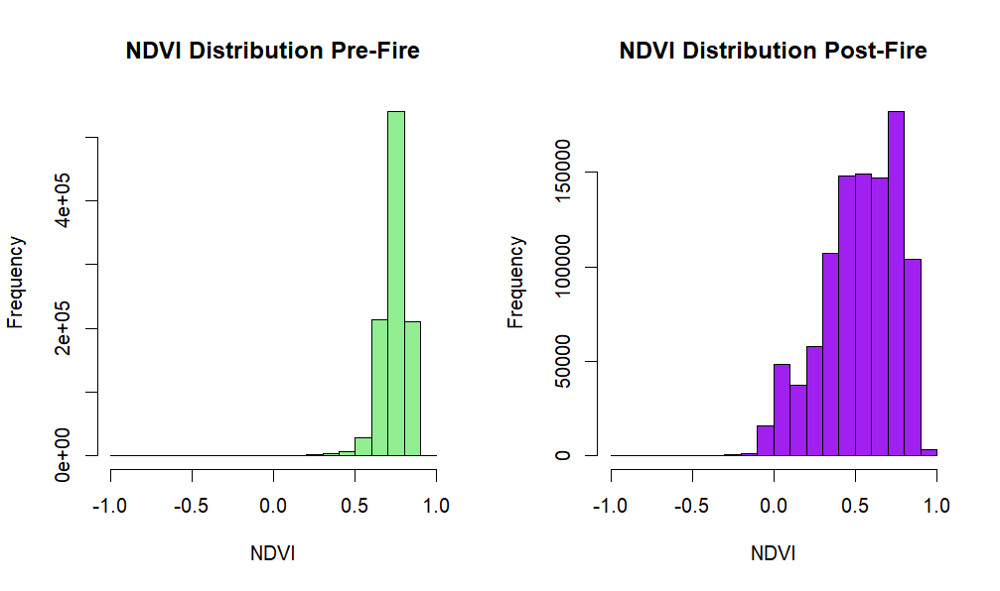

# **ANALYSIS OF THE AUSTRALIAN "BLACK SUMMER" (2019–2020)**
* **Author**: Ombretta Giancaspro
* **Date**: 2025-07-09
* **Course:** Spatial Ecology in R  
* **Author:** Ombretta Giancaspro

---

During the Australian summer of 2019–2020,  known as the **"Black Summer"**, catastrophic mega-fires burned millions of hectares across southeastern Australia, particularly in New South Wales. These bushfires devastated eucalyptus forest ecosystems, leading to severe ecological damage and massive loss of biodiversity.

In this project, I analyze the impact of the wildfires on forest vegetation using **Sentinel-2 L2A** satellite imagery provided by Copernicus across two key timeframes:
* **Pre-fire phase:** November 2019 in which intact foliage and active forest canopy is found
* **Post-fire ehase:** March 2020 providing a clear view of post-fire scars once the clouds and smoke generated by the wildfires had fully dissipated. )

To quantify canopy loss and assess burn severity, three spectral indices were calculated:
* **NDVI (Normalized Difference Vegetation Index):** Measures vegetation vigor and photosynthetic health.
* **DVI (Difference Vegetation Index):** Quantifies absolute biomass quantity.
* **NBR (Normalized Burn Ratio):** Specifically highlights burned areas and burn severity.
  
These indices were integrated into a multi-step analytical workflow to assess the spatial extent and ecological severity of the fires.
Each index was computed independently for both timeframes (November 2019 and March 2020) to capture baseline conditions and post-fire conditions.
Differential rasters were derived by subtracting post-fire values from pre-fire values. This isolated the net loss of photosynthetic activity and identified the precise spatial footprint of the fire scars.
$\text{NDVI}$ values, then were used to establish a threshold-based classification matrix. This enabled the categorical separation of unburned healthy forest canopy from severely burned or bare soil areas, allowing for a precise statistical quantification of the total impacted surface area.


<details>
  <summary><h2>2. Study area and dataset</h2></summary>

The selected study area is part of the forest regions of New South Wales, Australia. 



Satellite imagery was acquired via Copernicus Browser using single spectral bands from Sentinel-2 L2A:
* **Band 4 (B04 - Red):** $\lambda \approx 665\text{ nm}$
* **Band 8 (B08 - Near-Infrared / NIR):** $\lambda \approx 842\text{ nm}$
* **Band 12 (B12 - Short-Wave Infrared / SWIR2):** $\lambda \approx 2190\text{ nm}$

foto bande 
</details>

<details>
  <summary><h2>3.Methodology</h2></summary>

### 3.1 R Libraries Loading, directory setup and importing of satellite bands

```r
#LOADING NECESSARY LIBRARIES 
library(terra)      # For raster handling and satellite spatial data
library(ggplot2)    # For statistical graphics and bar charts
library(reshape2)   # For tabular data restructuring
library(viridis)    # For scientific, colorblind-friendly palettes

# SETTING WORKING DIRECTORY & IMPORTING RAW SATELLITE BANDS 
setwd("C:/Users/lenovo/Desktop/exam_R")

# Import pre-fire/post-fire bands and combine single bands into a multi-layer raster object
b4_pre  <- rast("2019-11-01-00_00_2019-11-01-23_59_Sentinel-2_L2A_B04_(Raw).tiff")
b8_pre  <- rast("2019-11-01-00_00_2019-11-01-23_59_Sentinel-2_L2A_B08_(Raw).tiff")
b12_pre <- rast("2019-11-01-00_00_2019-11-01-23_59_Sentinel-2_L2A_B12_(Raw).tiff")

pre <- c(b4_pre, b8_pre, b12_pre)
names(pre) <- c("B04", "B08", "B12")

b4_post  <- rast("2020-03-30-00_00_2020-03-30-23_59_Sentinel-2_L2A_B04_(Raw).tiff")
b8_post  <- rast("2020-03-30-00_00_2020-03-30-23_59_Sentinel-2_L2A_B08_(Raw).tiff")
b12_post <- rast("2020-03-30-00_00_2020-03-30-23_59_Sentinel-2_L2A_B12_(Raw).tiff")

post <- c(b4_post, b8_post, b12_post)
names(post) <- c("B04", "B08", "B12")
```

###3.2 False Color RGB 
composite images highlight moisture loss and soil exposure: by combining Band 12 (SWIR2), Band 8 (NIR), and Band 4 (Red):
```r
# Visual of bands in False Color
par(mfrow = c(1, 2))
plotRGB(pre, r = 3, g = 2, b = 1, stretch = "lin", main = "Pre-Fire False Color (Nov 2019)")
plotRGB(post, r = 3, g = 2, b = 1, stretch = "lin", main = "Post-Fire False Color (Mar 2020)")
dev.off()
```


Comment: The Pre-fire image displays healthy vegetation canopy in dense foliage tones. In the Post-Fire composite, bright scarred areas clearly demarcate the extent of fire destruction and soil exposure.
</details>
<details>
  <summary><h2>4.Spectral Indices Ccmputation</h2></summary>
   
###4.1 Normalized Burn Ratio (NBR) and burn severity

The Normalized Burn Ratio uses Near-Infrared (NIR) and Short-Wave Infrared (SWIR2) bands:

$$NBR = \frac{NIR - SWIR2}{NIR + SWIR2}$$

$$dNBR = NBR_{Pre} - NBR_{Post}$$
```r 
nbr_pre  <- (pre[["B08"]] - pre[["B12"]]) / (pre[["B08"]] + pre[["B12"]])
nbr_post <- (post[["B08"]] - post[["B12"]]) / (post[["B08"]] + post[["B12"]])
dnbr     <- nbr_pre - nbr_post

par(mfrow = c(1, 2))
plot(nbr_pre, main = "NBR Pre-Fire", col = viridis(100))
plot(nbr_post, main = "NBR Post-Fire", col = viridis(100))
dev.off()

plot(dnbr, main = "dNBR (Burn Severity)", col = inferno(100))
```



Comment: High positive values in $\text{dNBR}$ (bright yellow/orange regions in the inferno palette) directly locate zones of high burn severity where vegetation canopy was consumed by fire.

###4.2 Difference Vegetation Index (DVI)

The Difference Vegetation Index evaluates absolute vegetative biomass without normalization:
$$DVI = NIR - RED$$

$$\Delta DVI = DVI_{Pre} - DVI_{Post}$$

```r
dvi_pre  <- pre[["B08"]] - pre[["B04"]]
dvi_post <- post[["B08"]] - post[["B04"]]
ddvi     <- dvi_pre - dvi_post

par(mfrow = c(1, 2))
plot(dvi_pre, main = "DVI Pre-Fire", col = viridis(100))
plot(dvi_post, main = "DVI Post-Fire", col = viridis(100))
dev.off()

plot(ddvi, main = "ΔDVI", col = inferno(100))
```


###4.3 Normalized Difference Vegetation Index 

The NDVI measures photosynthetic vigor:
$$NDVI = \frac{NIR - RED}{NIR + RED}$$

$$\Delta NDVI = NDVI_{Pre} - NDVI_{Post}$$
```r
ndvi_pre  <- (pre[["B08"]] - pre[["B04"]]) / (pre[["B08"]] + pre[["B04"]])
ndvi_post <- (post[["B08"]] - post[["B04"]]) / (post[["B08"]] + post[["B04"]])
dndvi     <- ndvi_pre - ndvi_post

par(mfrow = c(1, 2))
plot(ndvi_pre, main = "NDVI Pre-Fire", col = viridis(100))
plot(ndvi_post, main = "NDVI Post-Fire", col = viridis(100))
dev.off()
#Comparative histogram of NDVI distribution
par(mfrow = c(1, 2))
hist(ndvi_pre, main = "NDVI Distribution Pre-Fire", col = "forestgreen", xlab = "NDVI")
hist(ndvi_post, main = "NDVI Distribution Post-Fire", col = "firebrick", xlab = "NDVI")
dev.off()
plot(dndvi, main = "ΔNDVI", col = inferno(100))
```



</details>

<details>
  <summary><h2>5.Classification & Statistical Quantification</h2></summary>
Land Cover Classification & Statistical Quantification 
To isolate land surface dynamics from water bodies or clouds, a threshold reclassification matrix was applied:
* $NDVI < 0.1 \rightarrow NA$ (Excludes water/ocean bodies and non-land pixels)
* $0.1 \le NDVI \le 0.55 \rightarrow \mathbf{0}$ (Burned Area / Bare Soil / Low Vigor Vegetation - **Purple**)
* $NDVI > 0.55 \rightarrow \mathbf{1}$ (Healthy Forest / Dense Vegetation Canopy - **Light Green**)

```r
soglia_water <- 0.1
soglia_veg   <- 0.55

reclass_matrix <- matrix(c(-Inf, soglia_water, NA,
                           soglia_water, soglia_veg, 0,
                           soglia_veg, Inf, 1),
                        ncol = 3, byrow = TRUE)

classi_pre  <- classify(ndvi_pre, reclass_matrix)
classi_post <- classify(ndvi_post, reclass_matrix)

# Visualizing classified maps
par(mfrow = c(1, 2))
plot(classi_pre, main = "NDVI Classes Pre-Fire", col = c("purple", "lightgreen"))
plot(classi_post, main = "NDVI Classes Post-Fire", col = c("purple", "lightgreen"))
dev.off()
```

```r

# Frequency calculation
freq_pre  <- freq(classi_pre)
freq_post <- freq(classi_post)

# Extract pixel counts safely
count_pre_veg  <- ifelse(1 %in% freq_pre$value, freq_pre[freq_pre$value == 1, "count"], 0)
count_pre_burn <- ifelse(0 %in% freq_pre$value, freq_pre[freq_pre$value == 0, "count"], 0)

count_post_veg  <- ifelse(1 %in% freq_post$value, freq_post[freq_post$value == 1, "count"], 0)
count_post_burn <- ifelse(0 %in% freq_post$value, freq_post[freq_post$value == 0, "count"], 0)

# Total land surface pixels
tot_land_pre  <- count_pre_veg + count_pre_burn
tot_land_post <- count_post_veg + count_post_burn

# Percentages
perc_pre_veg  <- (count_pre_veg / tot_land_pre) * 100
perc_pre_burn <- (count_pre_burn / tot_land_pre) * 100

perc_post_veg  <- (count_post_veg / tot_land_post) * 100
perc_post_burn <- (count_post_burn / tot_land_post) * 100

# Summary Data Frame
summary_table <- data.frame(
  Class        = c("Burned / Bare Soil", "Healthy Vegetation"),
  Pre_Fire     = round(c(perc_pre_burn, perc_pre_veg), 2),
  Post_Fire    = round(c(perc_post_burn, perc_post_veg), 2)
)

print(summary_table)
```
### Summary Table (Land Cover Percentages)

| Class | Pre-Fire (%) | Post-Fire (%) |
| :--- | :---: | :---: |
| **Burned / Bare Soil** | 1.85 | 45.54 |
| **Healthy Vegetation** | 98.15 | 54.46 |

</details>
<details> 
   <summary><h2>Visualization of results </h2></summary>

A comparative bar chart was built using ggplot2 to evaluate changes in land cover class percentages:
```r
 #COMPARATIVE BAR CHART WITH GGPLOT2

df_long <- melt(summary_table, id.vars = "Class", 
                variable.name = "Period", 
                value.name = "Percentage")

ggplot(df_long, aes(x = Class, y = Percentage, fill = Period)) + 
  geom_bar(stat = "identity", position = "dodge") + 
  geom_text(aes(label = round(Percentage, 1)), 
            position = position_dodge(width = 0.9), 
            vjust = -0.25, size = 3.5) + 
  scale_fill_manual(values = c("Pre_Fire" = "lightblue", 
                               "Post_Fire" = "orange")) + 
  ylim(0, 100) + 
  labs(title = "Land Surface Vegetation Dynamics (Australian Black Summer)", 
       subtitle = "Percentage comparison of vegetation cover before and after the fires", 
       y = "Percentage (%)", x = "Class") + 
  theme_minimal()
```

</details>

<details>
   <summary><h2>Conclusions</h2></summary>
This geo-ecological analysis highlights the environmental impact of the 2019–2020 Australian "Black Summer" wildfires:
Biomass Loss: Spectral indices ($\text{NDVI}$, $\text{DVI}$, and $\text{NBR}$) showed a significant drop in values across the study region post-fire.Burn Severity Mapping: The $\text{dNBR}$ differential raster precisely identified the spatial footprint and severity of burned forest zones.Quantitative Shift: Threshold classification confirmed a major decrease in healthy forest coverage alongside a proportional expansion of burned/bare ground.Using multi-spectral satellite observations and open-source tools in R allows for rapid damage quantification, proving essential for ecological monitoring and post-fire forest management strategies.
</details>
